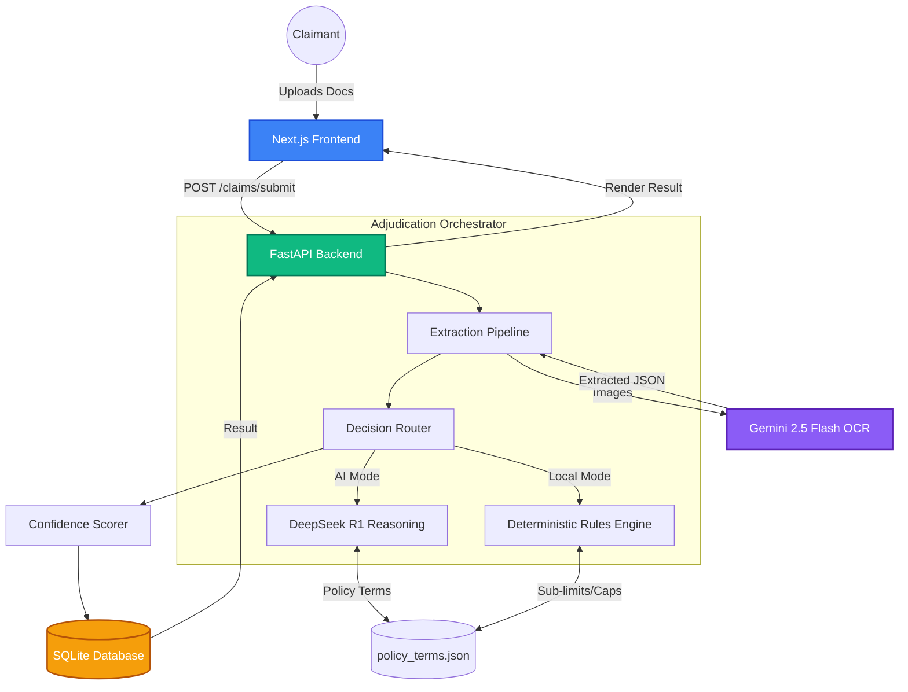
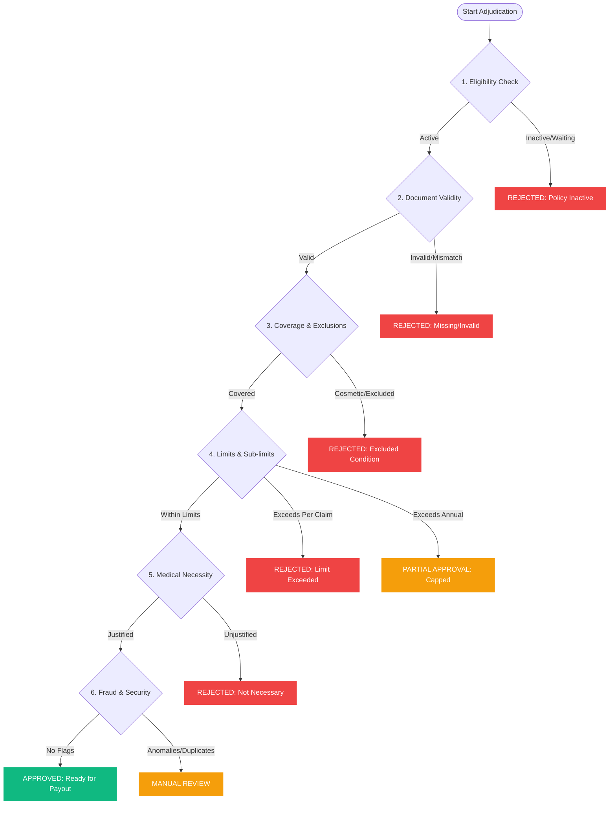

# 🌟 Plum AI OPD Claim Adjudication System

An intelligent, production-grade AI automation pipeline designed to process, extract, validate, and adjudicate Outpatient Department (OPD) medical claims using multimodal LLMs (Gemini 2.5 Flash Vision) and advanced reasoning engines (DeepSeek R1).

Built for the **Plum AI Automation Engineer Intern** assignment.

---
# video link
https://drive.google.com/file/d/1wK2hoiYClAAeyHsy-tXdFrTqclxUGwdO/view?usp=sharing

## 🎯 Executive Summary
This application transforms the highly manual, error-prone process of health insurance claim adjudication into a deterministic, AI-orchestrated pipeline. By combining the visual extraction power of **Gemini Vision** with the strict, step-by-step logic and reasoning of **DeepSeek R1**, the system achieves human-level auditing with complete mathematical enforcement of policy limits.

### ✨ Key Features
- **Multimodal OCR**: Upload medical prescriptions and invoices.
- **Dual-Engine Architecture**: 
  - *AI Chain*: DeepSeek R1 acts as a reasoning engine for complex semantic checks (Medical Necessity, Fraud Detection).
  - *Local Rules Engine*: A deterministic Python backend for instant, programmatic limit checks and sub-limit capping.
- **Explainable AI (XAI)**: A beautiful **Policy Validation Checklist** that translates raw JSON AI output into a sequential passed/bypassed/failed checklist for claims auditors.
- **Automated Test Suite**: A `/test-runner` dashboard to validate the deterministic rules engine instantly.

---

## 🏗️ System Architecture

The system is built using Domain-Driven Design (DDD) to isolate API routing, orchestration, LLM calling, and database persistence.



---

## 🧠 Decision Logic Flowchart



---

## 🚀 Setup & Installation

### 1. Prerequisites
- Node.js (v18+)
- Python (v3.9+)
- API Keys for Google Gemini & OpenRouter (DeepSeek)

### 2. Backend Setup
```bash
cd backend
python -m venv venv
source venv/bin/activate
pip install -r requirements.txt

# Create .env file
echo "GEMINI_API_KEY=your_key_here" > .env
echo "OPENROUTER_API_KEY=your_key_here" >> .env

# Run FastAPI Server
uvicorn app.main:app --host 0.0.0.0 --port 8000 --reload
```

### 3. Frontend Setup
```bash
cd frontend
npm install
npm run dev
```

The application will be running at `http://localhost:3000`.

---

## 📁 Project Documentation
- 📄 **[API Documentation](./docs/api_documentation.md)**: Detailed API specs.
- 🤔 **[Assumptions](./docs/assumptions.md)**: Logic and architecture assumptions.
- 🧪 **[Test Cases](./assignment_docs/test_cases.json)**: Ground truth data.

---

## 🏆 Evaluation Highlights

| Criteria | Implementation Details |
|----------|------------------------|
| **AI Integration** | Extracts data with Gemini Vision and runs complex semantic logic using DeepSeek R1 Chain-of-Thought. |
| **Code Quality** | Pure Domain-Driven Design in Python. Modular `rule_engines`, `ai_pipelines`, and `adjudication` layers. |
| **User Experience** | Explainable AI UI that maps raw rejection codes into a readable checklist for non-technical claims adjusters. |
| **Bonus Features** | Multi-factor confidence scoring, dedicated automated test-runner suite, Local rule engine fallback. |

*Built for Plum's mission to protect 10M lives by 2025.* 💜
