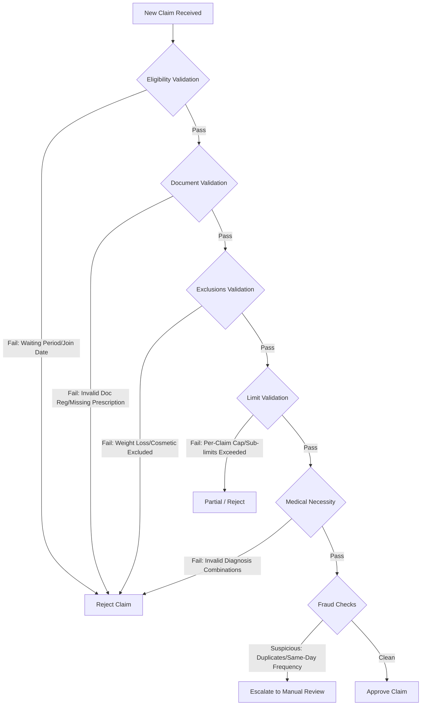

# Claim Adjudication Decision Flowchart

This document details the step-by-step logic executed by both the local programmatic rules engine and the DeepSeek R1 reasoning pipeline.

## Adjudication Stages

## Description of Steps

1. **Step 1: Basic Eligibility Check**:
   - Assures that the member is enrolled and the treatment date falls outside the 30-day initial waiting period or specific ailment exclusions (e.g. 90-day Diabetes waiting period).

2. **Step 2: Document Completeness**:
   - Checks for a valid doctor registration format (`State/Number/Year`).
   - Assures prescription text matches treatment dates.

3. **Step 3: Exclusions & Network Discounts**:
   - Checks diagnosis against the policy exclusion list (e.g., cosmetic dentistry, bariatric diet plans).
   - If hospital is network, applies 20% discount.

4. **Step 4: Limits Validation**:
   - Deducts copay (e.g. 10% on consultation).
   - Caps category specific claims under their sub-limits.
   - Enforces the ₹5,000 per-claim maximum.
