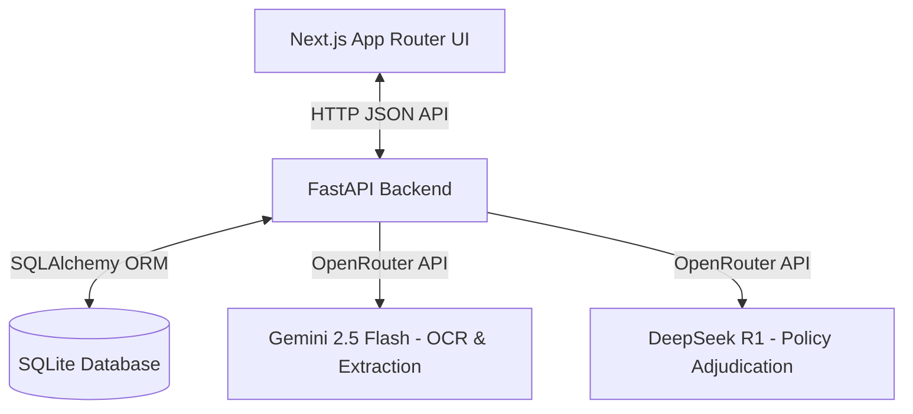

# System Architecture Documentation

This document describes the high-level design and data flow of the OPD Claim Adjudication Suite.

## Component Breakdown

1. **Frontend (Next.js)**:
   - Serves as the user interface for claim submissions, metrics display, configuration parameters, and manual review queues.
   - Communicates with the FastAPI backend through JSON API services.

2. **Backend (FastAPI)**:
   - Serves as the central API gateway.
   - Implements a programmatic hybrid rule engine alongside dual AI routing to handle both instant local validation and deep reasoning.

3. **Data Access Layer (SQLite + SQLAlchemy)**:
   - Stores persistent claims logs, patient data, and rule overrides in a local SQLite file (`claims.db`).

4. **AI Processing Layer (OpenRouter)**:
   - Gemini 2.5 Flash parses document texts into highly structured JSON formats.
   - DeepSeek R1 performs deep reasoning validations, compliance checks, and necessity audits, returning structured final verdicts.
